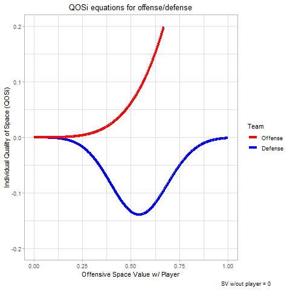
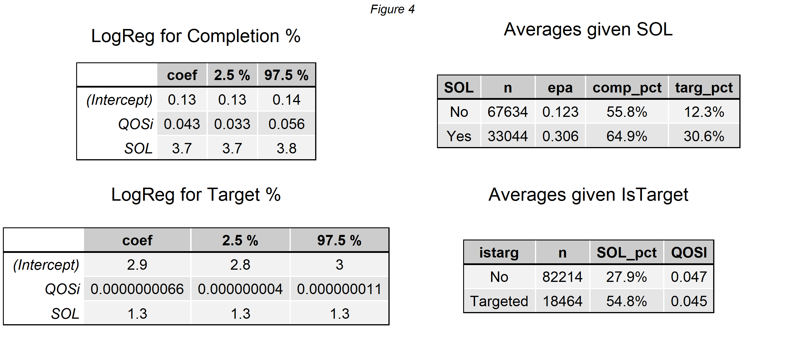

# BigDataBowl21_Kane
NFL Big Data Bowl 2021 Repo for Matt Kane

The Value of Space Occupation for NFL Defensive Backs

By Matthew Kane

I. Introduction

The capturing of data in sports has long been centered around the events that occur when a player has the ball. This can be seen across all sports, from homeruns in baseball to goals scored in soccer. However, as any casual fan could tell you, there is much more to the game than these easily measurable stats. As technology has progressed, so has our ability to capture and evaluate events that occur off the ball. In the NFL, measurements such as sprint speed, WR separation, and time in the pocket now control the new wave of in-game analysis. Yet, defensive statistics remain fairly untouched. The media, fans, and NFL based twitter accounts still over focus on the rare events when a defensive player controls the ball; such as a turnover, like a fumble or an interception. There remain several issue with that though as these plays are extremely rare and are often not the most consistent way of evaluating defensive talent.

Therefore, with the dataset provided by the NFL Big Data Bowl, I decided to evaluate defensive backs solely on what is happening off of the ball. Using a space occupation model (initially developed for soccer analysis), we can better attempt to capture how well a defender is limiting the options of the quarterback, simply by how they are moving. The impacts of this model can be seen through the in-game examples and analysis presented below.

II. Process

The basis for this space occupation models comes from the work of Javier Hernandez and Luke Bornn: Wide Open Spaces ([link](https://www.researchgate.net/publication/324942294_Wide_Open_Spaces_A_statistical_technique_for_measuring_space_creation_in_professional_soccer)). By making some minor adjustments and alterations, their player influence area method can be applied to the game of football. For a more detailed breakdown, the math can be found in the appendix of their publication.

The first step is calculating the player influence area for every player on the field. These influence areas are based on their distance from the ball, their speed, and their direction (create a covariance matrix based on the multiplication of a rotational matrix (direction the player is moving) and a scaling matrix (based on the distance from the ball and speed). After multiplying those together and getting each player’s influence area, we can aggregate to produce each team’s influence area on the field. This results in a statistic I call: Space Value (SV).

A value greater than 0.5 indicates that the offensive team has more control, while a value under 0.5 indicates that the defenders have more control / influence in that area.

However, this space value hardly tells the whole story as most defenders know that leaving a WR wide open 15 years down the field is much different than an open RB in the backfield on a swing route. To accommodate for this, we need to factor in the value of different positions on the field. Despite not knowing how the NFL’s xEPA model work, we can attempt to estimate this by taking subset of plays and modeling the resulting xEPA given the down, yardline, yardsToGo, playResult, and time left in the half. With these models, we can provide a field value (FV) for each yardline on the field which serves an estimate of xEPA for a play that ends at that yardmarker.

The final step of this model is to multiply the space value and the field value to create a metric called: Quality of Space (QOS). An example of these 3 measurements can be seen below in Figure 1 through a Dallas Goedert against the Falcons in the first game of 2018 ([link](https://youtu.be/r9l-ADHLQZc?t=1353)). As the first image shows, Goedert (#88) generates space as he turns towards the sidelines shortly before Foles releases the ball. The second value shows the field value on the play (xEPA of a touchdown = 4.97, xEPA of 10 yard gain = 0.59). And the third image shows the combination of the two through the QOS metric. Also seen on the play is the value created by Darren Sproles (#43) out of the backfield. Where, despite having a lower field value, he is considerably more open than Goedert, which winds up balancing out and producing a similarly valuable area (dark red) in front of each player.

While it’s nice to note how much control each team has in an area of the pitch, the real value stems from how each individual contributes to their team’s QOS. Through two separate with-or-without-you equations (one for offensive players, the other for defensive), we derive an individual Quality of Space (QOSi) measurement that attempts to value each player’s contribution to their team’s field control.

Figure 2 below shows how the QOSi value fluctuates given the QOS metric with the player on the field, and what the QOS would be with the player off the field. For a defender, they are given a negative QOSi when the offensive SV is greater with them on the pitch than if they were not there. This model also diminishes the value of having an offensive SV close to 0, as this likely indicates that there is no offensive player in the area and the defender is occupying vacant space. It is for this reason that the peak of their values lies in creating a situation that slightly favors the defender (SV between 0.3-0.5), indicating that they are taking away valuable space from an offensive player.

Figure 3 provides an example from the same Falcons v. Eagles game of Week 1. On this play, Jalen Mills bites on a Julio Jones double move as he completes a go route ([link](https://twitter.com/NFL/status/1037899545567346688)). Walking through the play:

We first notice that the QOSi values for both Mills (#31) and Jones (#11) steadily rise after the ball is snapped, due to their increase in pitch value as they move down the field into more valuable positions.

After this, we see McLeod (#23) gain value by sliding over towards the sideline, likely to help cover any curl or hitch route. Since Jones slows down and appears to be running a hitch route, his value drops as he enters into the space covered by McLeod, which further raises McLeod’s QOSi.

Then, Mills bites on the hitch route as Jones turns upfield. During this time, Jones QOSi shoots up while both Mills and McLeod experience space occupation loss (SOL), or in other words, a sharp drop in QOSi.

-   Note that the green player highlights indicate the occupation of valuable space (QOSi >= 0.075)
    McLeod and Mills were both in valuable space before Jones turned back up field, where Jones then became the one highlighted in light green.

III. Analysis

Before we start breaking down the potential uses of these metrics, it is best to first confirm that they provide meaning and insight into plays. By running a two simple logistic regression models, it becomes clear that these metrics fall in line with important play results.

Via figure 4, the two models are saying that when modeling for target% and completion%, the prediction rates go down if the defensive player has a higher QOSi and the prediction rates go up if the defender experiences significant space occupation loss. In simpler terms, to limit targets and high completion percentages, it is better for a defender to have a high QOSi and not experience SOL. When looking at the intercepts, it is possible to conclude that the completion percentage model starts low and an occurrence of SOL drives it up. Vice versa with target percentage and QOSi being low. Basically, it goes to show that the value of space is more important in whether or not defensive backs get targeted (i.e. QB picks on defenders in poor positions), while experiencing a significant loss in space is key in determining if the catch was made (i.e. easier catch for WR if defender experiences significant loss in positioning).

The 2 tables to the right confirm this through simple averages. Defenders who undergo SOL in coverage are targeted almost 3x as much for a higher completion percentage and much higher EPA.

In first looking at each players overall stats, I pulled a few names from the top and bottom of the list for the defensive back positions. Via figure 5, we can look at the top end CBs of Peters and Sherman and note that their SOL% is much lower than King and Alexander, same goes for their target%, suggesting that because they don’t rapidly lose space as often, they get thrown at less. The same can be said for Adams at the SS position. When looking at the free safeties, Baker stands out for his high completion% allowed. Despite having a lower SOL% than Jackson and many other FSs, Baker seems to have either been a tad unlucky with this high completion% or it could potentially be an area of weakness that needs to be developed. Along the same lines, Alexander seems a tad lucky from the CB position. Despite his high SOL%, the target rate remains low and his EPA is also extremely low. A combination of luck and defensive schemes likely allowed him to succeed despite the poor space occupation ratings.

When breaking it down by route, it becomes easy to see that M. Jenkins was the far superior SS compared to Williams when defending crossing routes. Same can be said for Jones against J. Jenkins when covering a slant. The route table also provides insight into Baker’s unluckiness, as Mathieu had worse space occupation ratings, yet saw much better results through his EPA and completion%. It could also be due to the fact that the veteran Mathieu is potentially more physical than a second-year Budda Baker. Similarly, Alexander’s luckiness is also further exposed on go routes, being more frequently in a bad position, yet not paying the price like Peters did with an unusually high 82% completion rate.

A similar breakdown can be provided by team and opponent formation, similar to players and routes. It would appear that Chicago’s defense was the luckiest (or perhaps had a better defensive scheme), seeing as non-targeted defenders saw at least one of them have a SOL loss on nearly 80% of plays, while their targeted defenders were at a 60.3% clip.

In selecting two of the better corner backs, Gilmore and Haden, we can compare them by route to see when exactly they excel. For instance, Gilmore is better at occupying space during the entire duration of an out route, on average. Whereas, on post routes, Gilmore’s skill shows up towards the end of the route (0 = ball_snap, 1 = pass_forward), as he is able to gain QOSi towards the later half of the QB’s dropback at a greater rate than Haden is. The opposite can be said for in routes, as Gilmore seems to slack towards the end of the route while Haden maintains his QOSi better.

IV. Future Considerations

While the potential use cases for this metric could go on for a while, there are still many ways forward with this topic.

The first of which is to incorporate player orientation into the player influence area model. Doing so would allow further analysis into things like a defender getting turned around (like Mills), which WR orientations cause SOL in defensive backs, and the ability of a defensive back to adjust to the pass and pick it off.

On top of that, there should probably also be a time factor in the value of coverage, as the longer a defense is able to cover every player, the more valuable as it becomes more likely that the defensive line is able to break through and sack the QB.

Then for the QOSi equations, they were created off of intuition and weren't highly investigated in this analysis, as the main focus was to show the potential benefits of an individual space occupation metric as opposed to the process of selecting the best metric to do so. Given the potential for a larger analysis output, revamping the QOSi equations to better fit and predict game data would be ideal.

Lastly, there is the potential for better field values (xEPA) estimates. Using simple linear regression, we were able to closely approximate the xEPA model. However, this is obviously not perfect and saying “what’s the value if the play ended at this yardline” is not the most ideal way to capture the field value, as a good amount of passing plays result in yards after the catch.

V. Code

Github code

My apologies for the gif links, but putting them in the notebook directly resulted in too large of a kernel source. I hope you will understand. Thank you!

